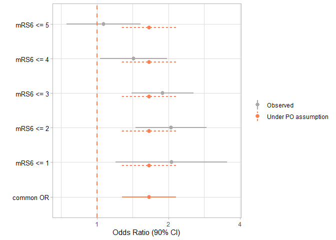
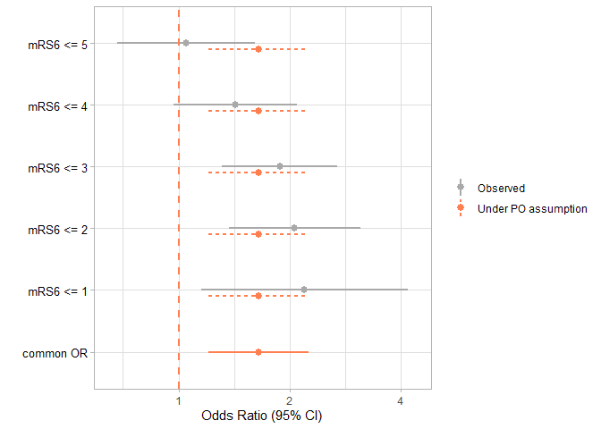

README
================

<!-- README.md is generated from README.Rmd. Please edit that file -->

# CORPlot

<!-- badges: start -->
<!-- badges: end -->

The goal of CORPlot is to create cumulative odds ratio plot to visually
inspect the proportional odds assumption from the proportional odds
model. For more explanation on the role of the proportional odds
assumption in ordinal outcome analysis, see our paper (Long et. al,
2025).

## Installation

You can install the development version of CORPlot from
[GitHub](https://github.com/) with:

``` r
# install.packages("pak")
pak::pak("Yongxi-Long/CORPlot")
```

## Example

There are three steps to make a cumulative odds ratio plot, each
corresponds to a function in this package:

- *PerformLogReg()*: Perform cumulative logistic regression (i.e., no
  proportionality constraint) and get all binary odds ratios
- *PerformPO()*: Perform the proportional odds model and get the common
  odds ratio
- *CORPlot()*: Create the cumulative odds ratio plot

Users can either directly input to the CORPlot() funtion and this
function will do the first two steps internally. Or users can choose to
supplied a data frame of odds ratios calculated externally and ask
CORPlot to make the plot.

### The dataset

We will use the *df_MR_CLEAN* example dataset included in the package.
It is from a randomized controlled trial investigating endovascular
therapy in patients with stroke (Berkhemer et al., 2015). The trial
enrolled 500 patients, with 233 assigned to the intervention group and
267 to the control group. The dataset contains three variables:

- mRS: Modified Rankin Scale. A 7-point ordinal scale used to measure
  patient outcomes
- group: Group assignment. 1 = Intervention, 0 = Control
- sex: Simulated variable for sex. 1 = Women, 0 = Men

Because very few patients fell into mRS category 0, we combine
categories 0 and 1 into a single category (labeled mRS = 1) to improve
representation in the Cumulative Odds Ratio plot.

``` r
data("df_MR_CLEAN")
df_MR_CLEAN <- df_MR_CLEAN |>
  dplyr::mutate(mRS6 = dplyr::case_when(
    mRS <= 1 ~ 1,
    TRUE ~ mRS
  ))
```

### Use *CORPlot*() directly

``` r
res <- CORPlot(
  data = df_MR_CLEAN,
  formula = mRS6 ~ group,
  GroupName = "group",
  confLevel = 0.9
)
# show the plot
plot(res)
```



``` r
# print the detailed ORs and confidence intervals
print(res,digits = 3)
#> 
#> 
#> Table: Odds Ratios
#> 
#> |   Label   |  OR   | lowerCI | upperCI |   type   |
#> |:---------:|:-----:|:-------:|:-------:|:--------:|
#> | mRS6 <= 1 | 2.056 |  1.196  |  3.534  | Observed |
#> | mRS6 <= 2 | 2.050 |  1.453  |  2.892  | Observed |
#> | mRS6 <= 3 | 1.890 |  1.399  |  2.554  | Observed |
#> | mRS6 <= 4 | 1.426 |  1.032  |  1.970  | Observed |
#> | mRS6 <= 5 | 1.065 |  0.744  |  1.525  | Observed |
#> | common OR | 1.657 |  1.274  |  2.155  | Observed |
```

### Step-by-step construction

We can also calculate the binary odds ratios and the common odds ratio
from elsewhere and supply a data.frame to *CORPlot()* to make the plot
only. The input data.frame must have the following columns:

- Label: label to distinguish the binary odds ratios for different
  cutpoints and the common odds ratio
  - There must be a label identifying the common odds ratio, can be one
    of “common odds ratio”, “common OR”, “cOR” (case insensitive).
- OR: odds ratios
- lowerCI: lower bound for the confidence interval
- upperCI: upper bound for the confidence interval

``` r
## use PerforLogReg function to get all binary odds ratios
# We calculate the odds ratio for the group effect, adjusted by sex
# This is done by putting both group and sex in the formula
# and ask for group effect by letting GroupName = "group"
# similarly, if we want the odds ratio of the sex effect, adjusted by group
# we can let GroupName = "sex"

binary_ORs_df <- PerformLogReg(data=df_MR_CLEAN,
              formula = mRS6~group+sex,
              GroupName = "group",
              upper = FALSE)

## use PerformPO to get the common odds ratio
cOR_df <- PerformPO(data=df_MR_CLEAN,
              formula = mRS6~group+sex,
              GroupName = "group",
              upper = FALSE)

## Combine the data.frame
OR_df <- rbind(binary_ORs_df,
               cOR_df)
OR_df |>
  kable(digits = 3, format = "markdown",
        caption = "Binary odds ratios and common odds ratio of the 7-point mRS outcome in the MR CLEAN trial") 
```

| Label      |    OR | lowerCI | upperCI |
|:-----------|------:|--------:|--------:|
| mRS6 \<= 1 | 2.195 |   1.154 |   4.175 |
| mRS6 \<= 2 | 2.063 |   1.369 |   3.110 |
| mRS6 \<= 3 | 1.878 |   1.312 |   2.690 |
| mRS6 \<= 4 | 1.425 |   0.968 |   2.096 |
| mRS6 \<= 5 | 1.049 |   0.684 |   1.608 |
| common OR  | 1.647 |   1.204 |   2.253 |

Binary odds ratios and common odds ratio of the 7-point mRS outcome in
the MR CLEAN trial

``` r

## Feed this data.frame to the CORPlot function
res2 <- CORPlot(OR_df = OR_df)
plot(res2)
```



## Reference

Berkhemer, O. A., Fransen, P. S., Beumer, D., Van Den Berg, L. A.,
Lingsma, H. F., Yoo, A. J., et al.others. (2015). A randomized trial of
intraarterial treatment for acute ischemic stroke. New England Journal
of Medicine, 372(1), 11–20.

Long, Y., Wiegers, E. J. A., Jacobs, B. C., Steyerberg, E. W., & Van
Zwet, E. W. (2025). Role of the Proportional Odds Assumption for the
Analysis of Ordinal Outcomes in Neurologic Trials. Neurology, 105(8),
e214146.
